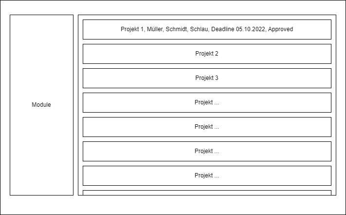

# Software Engineering

> Als Grundlage zu dieser Entscheidung muss jeder Student bzw. jede Projektgruppe zu jedem Thema eine
> Projektbeschreibung vorlegen. Sie besteht aus einem Projekttitel, einer kurzen Skizze (3-4 Sätze), einer
> kurzen Beschreibung des Projekthintergrundes zur Einordnung des Themas und eine genauere
> Beschreibung der wesentlichen Projektinhalte.

# Studiprojektverwaltungssoftware - Software Engineering WS22/23

Im Rahmen des Studiums bearbeiten Studenten mehrere Projekte im Bereich der Informatik. Diese Projekte dürften sich die Studenten zum Großteil selbst aussuchen, müssen jedoch Ihren Projektvorschlag vorher von den Mitarbeitern der Fachhochschule absegnen lassen. Um diese Arbeit den Mitarbeitern leichter zu gestalten, entwickeln wir eine Verwaltungssoftware.

## Funktionen

Die Software soll folgende Funktionen umsetzen:

### Projektverwaltung
1. Studenten und Mitarbeiter loggen sich mit FH-Login ein.
2. Erstellung eines Projekteantrags durch einen Studenten für Modul X.
3. Der Projektantrag beinhaltet folgende Attribute
     1. Titel
     2. Projektbeschreibung kurz (3-4 Sätze)
     3. Studenten bilden Gruppen mit bis zu 3 Mitgliedern
     4. Ausführliche Projektbeschreibung
     5. Vorschlag für Deadline
     6. Matrikelnummern der Projektmitglieder (bis zu 3 Stück)
     7. Emailadressen der Projektmitglieder
4. Ein Mitarbeiter der Fachhochschule kann den Antrag annehmen oder ablehnen.
5. Ein Mitarbeiter kann den Antrag kommentieren.
6. Ein Mitarbeiter kann die Projektattribute ändern.
7.  Terminierungsfunktion für die Projektvorstellung.
8.  Ansprechpartner von fremden Unternehmen zuweisen können
9.  Email für Ansprechpartner festlegen
10. Studenten können alle Aspekte das Projektes ändern (Titel, Beschreibung, Deadline, etc.)
11. Studenten können die Projektmitglieder ändern.
12. Wenn ein Student ein Projekt anlegt, wird er automatisch als Projektmitglied hinzugefügt.
13. Mitarbeiter können die Projektmitglieder ändern.
14. Rollenvergabe für die Projektmitglieder (Projektleiter, Projektmitglied, etc.)
15. Rollenvergabe für die Mitarbeiter (Projektbetreuer, Abnahmeprüfer, etc.)
16. Suchfunktion
17. Versionshistorie
18. Daten persistieren
  

---

### UI
1. Die Eintragungen von Projekten sollen in einer Liste dargestellt werden. Nicht einzelne Zeile, sondern mehrere, um alle wichtigen Informationen (Projektname, Kurzbeschreibung, Studenten, Ansprechpartner, Deadline, nächster Termin, Approved) anzuzeigen

---

### Meta
1. Überall Erreichbar - Laptop, Desktop, Smartphone (als Website, damit der Anwender nach Praktikas/Vorlesungen "schnell nebenbei" Änderungen eintragen kann)
2. Calender Subscriptions (CalDav / .ics => https://en.wikipedia.org/wiki/ICalendar)
3. Offene API für externe Anwendungen
4. Access System damit nur die Mitarbeiter, die mit einem jeweiligen Modul zu tun haben, Zugriff auf die Daten haben

