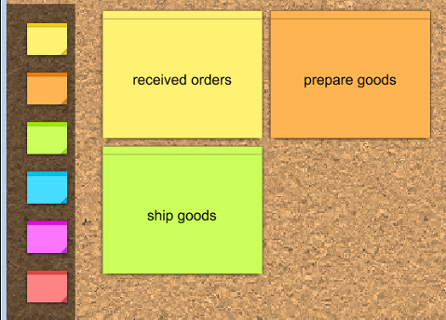

> Markieren Sie die
> verschiedenen Anforderungen farbig im Text und erläutern die identifizierten Bereiche kurz
> schriftlich.

# Brainstorm

Doku: https://www.visual-paradigm.com/support/documents/vpuserguide/26/2196/58045_usingbrainst.html

## Screenshot:

Features:
- Drag and Drop Notes
- Producing a task from a note
- Using tags you can catgeorize Notes into Task | Decision | Participant | Event

# Requirement Diagram

Doku: https://www.visual-paradigm.com/support/documents/vpuserguide/94/158_requirementd.html